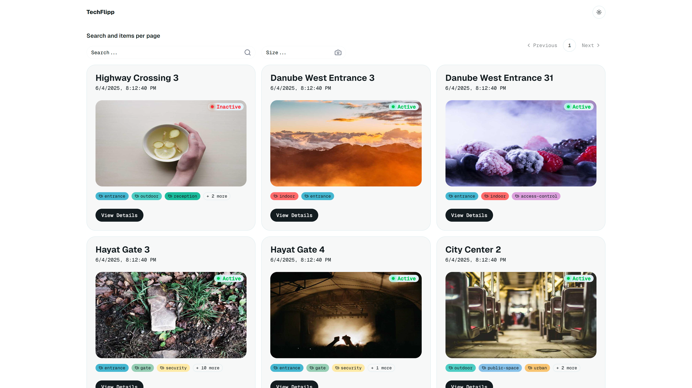
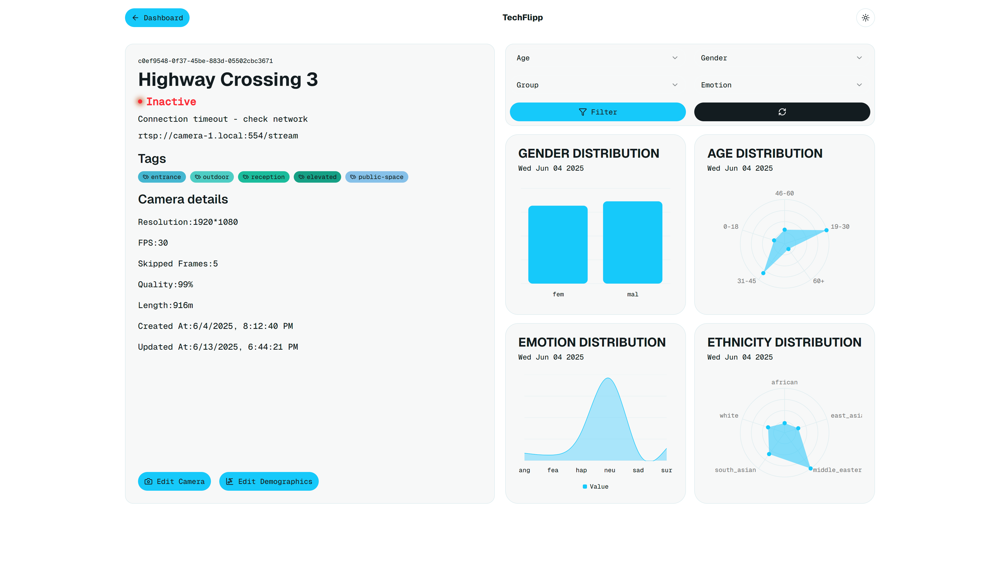
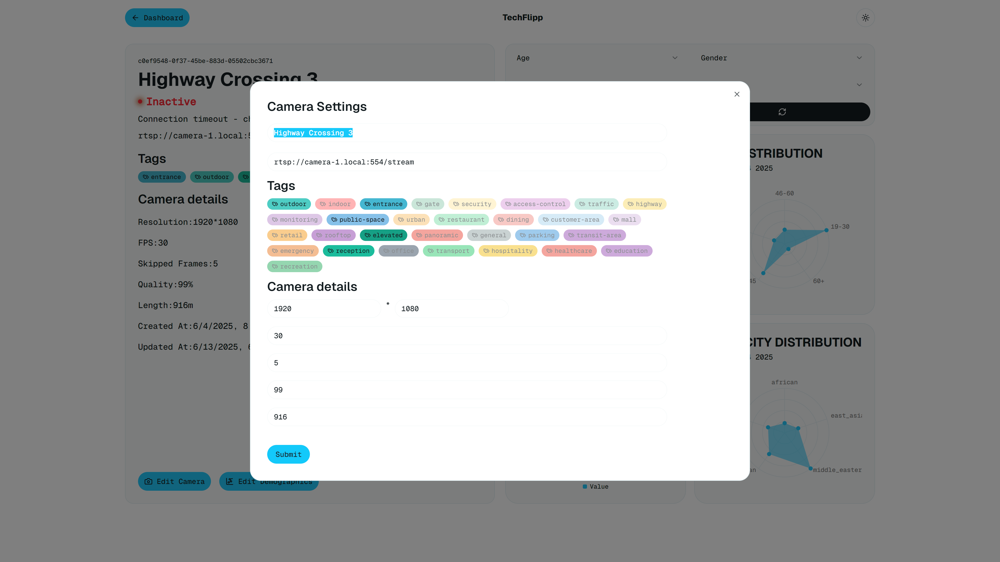
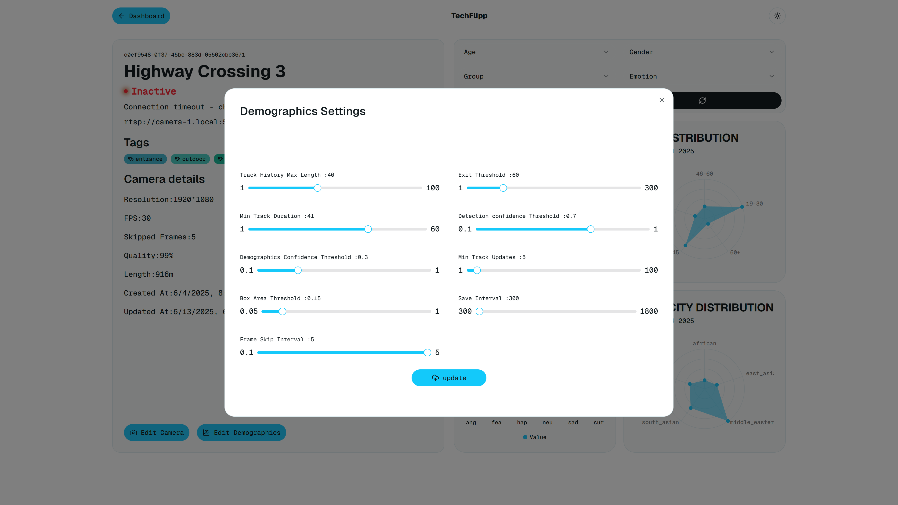

# TechFlipp Frontend Task — Camera Management Dashboard

A camera management dashboard built with Next.js 15 (App Router), Tailwind CSS v4, React Query, Axios, React Hook Form, Zod, and ShadCN UI components.

## 📦 Setup Instructions

1. **Clone the repo**

```bash
git clone https://github.com/MhassanAv/hiring-task-dashboard-451.git
cd hiring-task-dashboard-451
```

2. **Install dependencies**

```bash
yarn install
```

3. **Run development server**

```bash
yarn dev
```

4. **Open your browser**

Navigate to <http://localhost:3000>

5. **API Base URL**

Uses a public API: <https://task-451-api.ryd.wafaicloud.com>

## 🚀 Overview of Implementation

- Uses the Next.js 15 App Router with the app/ directory for routing and layouts.

- SSR pages to handle the cameras pages and revalidate on mutation with server actions

- Search input and size input for filtering cameras.

- Cameras page fetches and displays paginated camera data.

- Camera details and edit forms implemented using React Query's prefetching.

- Implementing React Query logic in server components with hydration boundaries and serve non empty SSR pages

- Forms use React Hook Form with Zod for validation and schema-based type safety.

- Modern Animations using framer-motion to improve the UX.

- Light and Dark modes with system preference detection using Next-Themes.

- Smooth Scrolling functionality using Lenis.

- Tag selection supports multi-select with toggling logic and synchronizes with form state.

- Controlled components used for sliders (ShadCN UI) integrated with form.

- Error and success feedback handled via Sonner toast notifications.

- Tailwind CSS v4 for styling with conditional classes based on data state.

- Skeleton loaders and loading indicators to improve UX during async data fetches.

- Pagination and search are controlled via URL query parameters for easy sharing and navigation.

- No global state library used; React Query handles all server state and caching.

## 💡 Assumptions and Design Decisions

- the UI is fully responsive as modern dashboard should be.

- As a Dashboard, I developed it to be a hybrid app,The client side is managed by React Query to handle form submissions and optimistic updates after mutations, In addition to SSR to leveraged the power of server side rendering,ISR can be used to generate the pages and revalidate on demand.

## 📷 Screenshots

### Cameras Home Page



### Camera Details



### Camera Edit



### Demographics Details & Edit



### Cameras Home Page Dark Mode


### Camera Details Dark Mode


## ✅ Completed Requirements

### ✅ 1. Camera List Page

- ✅ Implement a paginated view of cameras
- ✅ Allow users to control how many items appear per page
- ✅ Provide a way to search for cameras by name
- ✅ Display relevant camera information in a user-friendly manner

### ✅ 2. Camera Detail Page

- ✅ Create a view showing comprehensive camera information
- ✅Design an intuitive layout for camera details

### ✅ 3. Camera Update Functionality

- ✅ Develop a user interface for updating camera details
- ✅ Implement appropriate validation with meaningful feedback
- ✅ Consider the user experience during form submission

### ✅ 4. Demographics Configuration

- ✅ Enable users to create or edit demographics configuration for cameras - one to one relationship with camera
- ✅ Design form controls appropriate for each configuration parameter
- ✅ Ensure proper validation of configuration values

### ✅ 5. Demographics Results & Analytics

- ✅ Implement filtering capabilities for the data
- ✅ Create informative visualizations that convey demographic insights like charts, graphs, tables, etc.

## ✅ Completed Nice-to-Have Technical Features

- ✅ Different rendering ways as needed (SSR, ISR, SSG, etc.)
- ✅ Skeleton loading states to improve perceived performance
- ✅ Seamless data refresh mechanisms
- ✅ Render error messages in form fields
- ✅ Optimistic UI updates for a better user experience
- ✅ Organized state management
- ✅ Use React Query (TanStack Query) for fetching and caching data.
- ✅ Creative and intuitive UI/UX design
- ✅ SEO and performance optimizations
